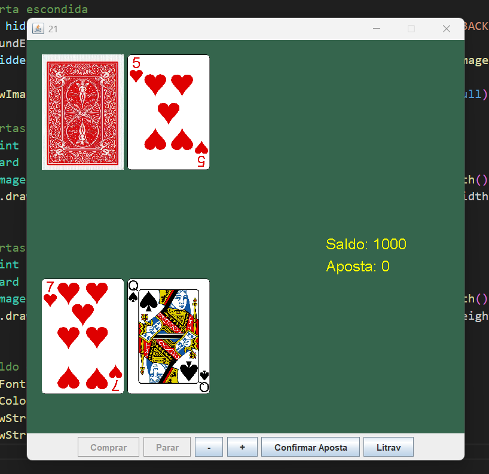
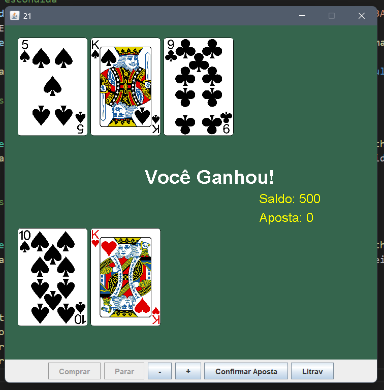
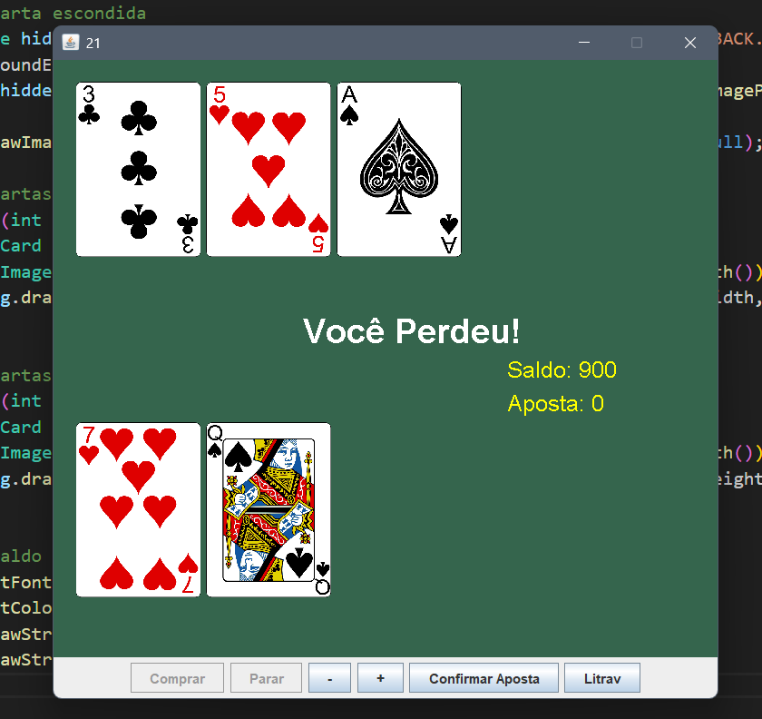
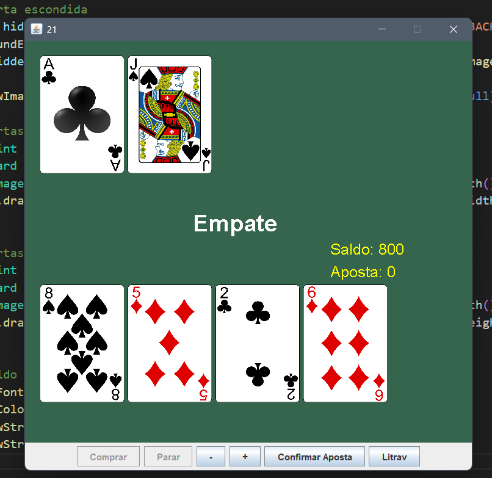

 # BlackJack

 inspirado no vídeo: https://www.youtube.com/watch?v=GMdgjaDdOjI
 Imagens e diversas funcionalidades retiradas do tutorial.

## Funcionalidades
- Sistema de apostas com moedas.
- Cartas visuais.
- Interface interativa com botões e feedback visual.

## Para rodar:
Necessário Java JDK 24.0.1
disponível em: https://www.oracle.com/br/java/technologies/javase/jdk24-archive-downloads.html
### **[➡️ Baixe o Jogo Executável (Blackjack.jar) Aqui ⬅️](dist/Blackjack.jar)**

# Criado Por:
Pedro Trofino
https://linkedin.com/in/pedro-trofino

## Screenshots

### Tela Inicial

### Tela de vitória

### Tela de derrota

### Tela de emapte

